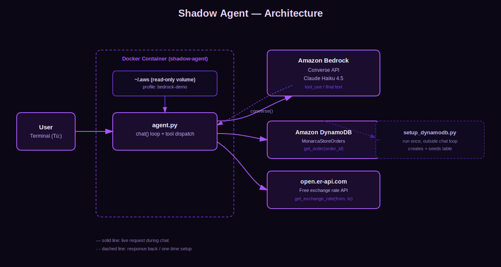

# shadow-agent 🤖⚔️
> Amazon Bedrock + Claude demo built for **AgentCamp Lima**
> From Rank E to Monarch: building autonomous agents on AWS

---

## What is this?

An e-commerce support agent built on **Amazon Bedrock + Claude (Haiku 4.5)**, packaged in Docker. The agent answers questions about real orders (queried live from **DynamoDB**) and live currency exchange rates (queried from a **free public API**), using natural language conversation and real tool calling — not a hardcoded script.

This project is **Level 2** of the agent evolution path (see [Evolution Summary](#evolution-summary)): an LLM with real tool calling against a real database and a real external API, instead of data baked into the system prompt.

---

## Repository structure

```
shadow-agent/
├── agent.py            # Main agent: chat loop, tool definitions, tool dispatch
├── setup_dynamodb.py   # One-time script: creates + seeds the DynamoDB table
├── architecture.svg    # Architecture diagram (see below)
├── Dockerfile          # Container image definition
├── docker-compose.yml  # Container configuration (volumes, env, tty)
├── requirements.txt    # Python dependencies (boto3, botocore)
└── README.md
```

---

## Architecture



**Flow:**
1. The user types a message in the terminal (`Tú: ...`).
2. `agent.py` sends the full conversation history to **Amazon Bedrock** via the **Converse API**, along with the definitions of two tools (`get_order`, `get_exchange_rate`).
3. Claude Haiku 4.5 decides whether it needs a tool. If it does, Bedrock returns a `tool_use` block instead of a final answer.
4. `agent.py` executes the requested tool locally:
   - `get_order` → queries **DynamoDB** (`MonarcaStoreOrders` table) for the order by `order_id`.
   - `get_exchange_rate` → calls **open.er-api.com** (free, no API key) for the live rate between two currencies.
5. The tool's result is sent back to Bedrock as part of the conversation. Claude uses it to write the final, natural-language answer.
6. Steps 3–5 repeat automatically if the model needs more than one tool call in the same turn (e.g. "how much is my cancelled monitor in soles?" triggers both `get_order` and `get_exchange_rate`).

While a tool is running, the agent prints a short "buscando..." / "consultando..." message so the user gets feedback instead of a silent pause.

AWS credentials are never baked into the image — they're mounted read-only from the host (`~/.aws:/root/.aws:ro`), so the same `bedrock-demo` profile works both for Bedrock calls and DynamoDB access.

---

## Prerequisites

- [Docker Desktop](https://www.docker.com/products/docker-desktop/) installed and running
- [AWS CLI](https://aws.amazon.com/cli/) installed
- Active AWS account

---

## Step 1 — Create IAM User

1. Go to [AWS Console](https://console.aws.amazon.com) → search **IAM**
2. Left menu → **Users** → **Create user**
3. Name: `bedrock-demo`
4. Click **Next**
5. Under permissions → **Attach policies directly**
6. Search and select these three policies:
   - `AmazonBedrockFullAccess`
   - `AWSMarketplaceFullAccess`
   - `AmazonDynamoDBFullAccess` *(needed for `get_order` and for `setup_dynamodb.py`)*
7. Click **Next** → **Create user**

---

## Step 2 — Generate Credentials

1. Click on the `bedrock-demo` user
2. **Security credentials** tab
3. Scroll to **Access keys** → **Create access key**
4. Select **Local code** → **Next** → **Create access key**
5. ⚠️ **Copy and save:**
   - `Access key ID`
   - `Secret access key`
   > They are only shown once. Don't close the screen until you've saved them.

---

## Step 3 — Configure AWS Profile

Open your terminal and run:

```bash
aws configure --profile bedrock-demo
```

Enter the values when prompted:

```
AWS Access Key ID:     [paste your Access key ID]
AWS Secret Access Key: [paste your Secret access key]
Default region name:   us-east-1
Default output format: json
```

### Verify it works

```bash
aws sts get-caller-identity --profile bedrock-demo
```

You should see your `Account` and `UserId`. ✅

---

## Step 4 — Verify Available Models

```bash
aws bedrock list-inference-profiles --profile bedrock-demo --region us-east-1 --query "inferenceProfileSummaries[?contains(inferenceProfileId,'anthropic')].inferenceProfileId"
```

Confirm that `us.anthropic.claude-haiku-4-5-20251001-v1:0` appears in the list.

---

## Step 5 — Build the image

```bash
cd shadow-agent
docker compose build
```

---

## Step 6 — Set up DynamoDB (`setup_dynamodb.py`)

This script is **run once, inside Docker**, before the first chat session. It:
1. Creates the `MonarcaStoreOrders` table (`order_id` as partition key, `PAY_PER_REQUEST` billing — no fixed cost).
2. If the table already exists, it skips creation and only re-seeds the data.
3. Loads 4 sample orders (same ones from the original demo script) using `batch_writer` for an efficient bulk insert.

Run it with:

```bash
docker compose run --rm shadow-agent python setup_dynamodb.py
```

Expected output:

```
Creando tabla 'MonarcaStoreOrders'...
✅ Tabla creada.
✅ 4 órdenes cargadas en 'MonarcaStoreOrders'.
```

`--rm` removes the temporary container as soon as the script finishes, so it doesn't linger. You only need to run this once — re-run it later only if you want to reset the table's data.

---

## Step 7 — Run the agent

```bash
docker compose run shadow-agent
```

---

## Conversation Example

```
Tú: dónde está mi orden 1001

🔍 Buscando tu orden, espera un momento...

Shadow Agent: ¡Hola! Tu Laptop Gaming MSI (orden #1001) ya fue enviada
y llega mañana. ¿Necesitas algo más?

Tú: cuánto es en soles el monitor LG que cancelé

🔍 Buscando tu orden, espera un momento...
💱 Consultando el tipo de cambio, espera un momento...

Shadow Agent: La orden #1004 (Monitor LG 4K) fue cancelada por el
cliente, así que no hay ningún cargo pendiente. Si tienes dudas sobre
otra compra, cuéntame el número de orden. 😊

Tú: salir
Shadow Agent: ¡Hasta luego! Que la sombra te acompañe. 👋
```

---

## Security Note

- AWS credentials are mounted as a read-only volume (`~/.aws:/root/.aws:ro`). They are **never** copied inside the Docker image.
- The container needs outbound internet access to reach both AWS endpoints (Bedrock, DynamoDB) and `open.er-api.com` — this works out of the box with Docker's default bridge network.

---

## How it works internally

```
┌─────────────┐   question    ┌──────────────────┐   tool_use    ┌───────────────┐
│    User     │ ────────────▶ │  Amazon Bedrock   │ ────────────▶ │  agent.py     │
│  (terminal) │ ◀──────────── │  Converse API     │ ◀──────────── │  tool dispatch│
└─────────────┘   answer      │  Claude Haiku 4.5 │  tool_result  └───────┬───────┘
                                └──────────────────┘                       │
                                                              ┌────────────┴────────────┐
                                                              ▼                          ▼
                                                    ┌───────────────────┐     ┌──────────────────┐
                                                    │  Amazon DynamoDB  │     │  open.er-api.com  │
                                                    │  MonarcaStoreOrders│     │  Exchange rates   │
                                                    └───────────────────┘     └──────────────────┘
```

Unlike Level 1 (all "knowledge" living in the system prompt), here the agent's knowledge is **real and live**: order status comes from an actual database row, and currency rates come from an actual live feed. That's what evolves further in the next levels.

---

## How can it evolve? 🚀

This project is Level 2. Here are the next steps from Rank E to Monarch:

---

### Level 3 — Orchestration with Step Functions
When the agent needs to execute complex flows: validate payment, update inventory, notify the customer. All visually coordinated.

```
Bedrock Agent → Step Functions → [Lambda 1 → Lambda 2 → Lambda 3] → result
```

---

### Level 4 — Events with EventBridge
The agent reacts to system events: a new order, a failed payment, a delayed shipment. Without the user having to ask.

```
Event (new order) → EventBridge → Bedrock Agent → automatic action
```

---

### Level 5 — Multi-Agent System
An orchestrator agent (The Monarch) that coordinates specialized sub-agents: one for payments, one for logistics, one for support.

```
                    ┌── Payments Agent
User → Monarch ─────┼── Logistics Agent
                    └── Support Agent
```

---

### Level 6 — RAG with Knowledge Base
The agent queries up-to-date documentation: manuals, policies, FAQs. Without retraining the model.

```
Question → Bedrock Agent → Knowledge Base (S3 + embeddings) → contextual response
```

---

### Level 7 — Full Observability
Logs of every agent decision, tool calling traces, latency and cost metrics.

- AWS CloudWatch Logs and Dashboards
- AWS X-Ray for traces
- Automatic alerts for anomalies

---

## Evolution Summary

| Level | Name | Key Technology | Complexity |
|-------|------|---------------|------------|
| 1 | System Prompt | Bedrock + Docker | Low |
| 2 ⭐ | Tool Calling | Lambda-free direct calls: DynamoDB + external API | Medium |
| 3 | Orchestration | Step Functions | Medium |
| 4 | Events | EventBridge | Medium |
| 5 | Multi-Agent | Bedrock Supervisor | High |
| 6 | RAG | Knowledge Bases | High |
| 7 | Observability | CloudWatch + X-Ray | Medium |

---

## Approximate Costs (us-east-1)

| Resource | Estimated Cost |
|----------|---------------|
| Claude Haiku 4.5 (input) | $0.80 / 1M tokens |
| Claude Haiku 4.5 (output) | $4.00 / 1M tokens |
| DynamoDB (PAY_PER_REQUEST, demo scale) | fractions of a cent |
| open.er-api.com | Free |
| 10-minute demo | < $0.01 |

---

## Troubleshooting

| Error | Solution |
|-------|----------|
| `AccessDeniedException` (Bedrock) | Add `AWSMarketplaceFullAccess` policy to the IAM user |
| `AccessDeniedException` (DynamoDB) | Add `AmazonDynamoDBFullAccess` to the IAM user |
| `ResourceNotFoundException` on table | Run `setup_dynamodb.py` before starting the agent |
| `ResourceNotFoundException` Legacy (model) | Change modelId to `us.anthropic.claude-haiku-4-5-20251001-v1:0` |
| `ValidationException` on-demand | Use inference profile with `us.` prefix |
| Credentials not found | Verify `~/.aws/credentials` has the `bedrock-demo` profile |
| No response from exchange rate tool | Check container has outbound internet access |

---

## Built for Costa Rica Demo

> *"Power is not inherited. It is earned. Step by step."*
